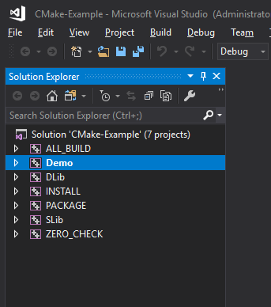

# This CMake Example

This is simple CMake Example.

It doesn't contain any wise C++ code, it shows how to use CMake, in particular:
- create Static library (StaticLib.lib)
- create Dynamic library (DynamicLib.dll)
- provide demo application which use both libraries (Demo.exe)
- Install feature, which install all 3 components (Demo.exe, StaticLib.lib, DynamicLib.dll and headers) on machine where CMake Install is executed (CMake Install)
- Installation Package (single file (.exe, .7z, .zip etc.)) that contain above components, so program could be distributed and installed on other machines (CPack)

# To run this example:
- download repository on your hard-disk
- in the downloaded folder in command line run `cmake" -H. -Bbuild`. This will create `build` directory and e.g. generate solution to Visual Studio
- After opening .sln in Visual Studio you should see something like that

               

# To Do:
- Source Package (to distribute sources)
- GoogleTests integration (to test StaticLib and DynamicLib code)
